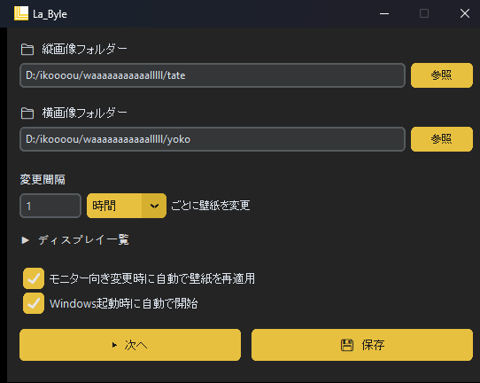

# La_Byle

縦横モニター対応の壁紙スライドショーアプリ。

Automatically assigns wallpapers based on monitor orientation (landscape/portrait) for multi-monitor setups on Windows.



## Features / 機能

- **向き別フォルダー指定** — 横向き・縦向きモニターに別々の壁紙フォルダーを設定
- **自動ランダム変更** — 設定した間隔（分または時間単位）でフォルダー内の画像を完全ランダムに変更（デフォルト: 6 時間）
- **再帰フォルダー走査** — サブフォルダー内の画像も含めてランダム選択の対象にする
- **向き変更検知** — モニターの向き（縦↔横）変更を自動検知して壁紙を再適用
- **タスクトレイ常駐** — ×で閉じてもバックグラウンドで動作し続ける
- **スタートアップ登録** — Windows 起動時に自動で常駐開始（管理者権限不要）
- **ダークテーマ GUI** — 光文明ゴールドのカスタムテーマ

## Requirements / 動作要件

- **OS:** Windows 10 / 11
- **Python:** 3.10 以上（`X | Y` 型ヒント構文を使用）

## Installation / インストール

### exe から実行（推奨）

[Releases](https://github.com/YoyogiPinball/La_Byle/releases) から `La_Byle.exe` をダウンロードして実行。

### ソースから実行

```bash
git clone https://github.com/YoyogiPinball/La_Byle.git
cd La_Byle
pip install -r requirements.txt
pythonw run.pyw
```

## Usage / 使い方

1. 縦画像フォルダー・横画像フォルダーを設定
2. 変更間隔を設定（分または時間単位）
3. 「💾 保存」で設定を保存
4. 「▶ 次へ」で今すぐ壁紙を変更

ウィンドウを閉じるとタスクトレイに格納されます。
タスクトレイアイコンをダブルクリックで設定画面を再表示できます。

## Configuration / 設定

設定は `config.json` に保存されます（初回起動時に自動生成）。

| 項目 | 説明 | デフォルト |
|------|------|-----------| 
| `landscape_folder` | 横向きモニター用の壁紙フォルダー（サブフォルダー含む） | （空） |
| `portrait_folder` | 縦向きモニター用の壁紙フォルダー（サブフォルダー含む） | （空） |
| `interval_minutes` | 壁紙変更間隔（分） | 360（6 時間） |
| `auto_reapply_on_orientation_change` | モニター向き変更時に自動再適用 | true |
| `auto_start` | Windows スタートアップに登録 | true |

対応画像形式: `.jpg` `.jpeg` `.png` `.bmp` `.webp`

## License

MIT License — 詳細は [LICENSE](LICENSE) を参照。
